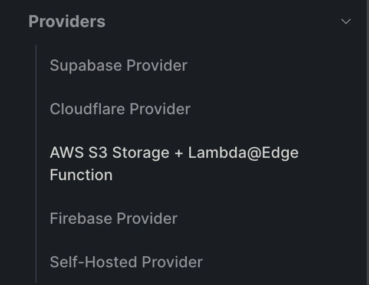

<!-- <iframe
  width="100%"
  height="420"
  src="/videos/deploy.mov"
  title="HotUpdater Video"
  frameborder="0"
  allow="accelerometer; autoplay; clipboard-write; encrypted-media; gyroscope; picture-in-picture"
  allowfullscreen
></iframe> -->

# [Hot Updater](https://hot-updater.dev/) [CloudFlare](https://www.cloudflare.com/)

### Giới thiệu

Hot Updater is a powerful alternative to react-native-codepush that provides self-hostable Over-The-Air (OTA) update capabilities for React Native applications. Unlike traditional app store updates, Hot Updater allows you to instantly update your JavaScript bundle, enabling rapid deployment of bug fixes and feature updates without waiting for app store approval.

<video width="100%" height="480" controls>
 <source src="./videos/deploy.mov" type="video/webm">
</video>

## Tại sao phải sử dụng Hot Updater

Self-Hosting: Maintain complete control over your update infrastructure and data
Multi-Platform Support: Seamless compatibility with both iOS and Android platforms
Flexible Deployment: Support for multiple environments and channels

## AWS S3 Storage + Lambda@Edge

In this comprehensive guide, we'll walk through setting up Hot Updater using the AWS S3 Storage + Lambda@Edge Function provider for storing React Native bundles in the cloud. Hot Updater supports multiple providers as shown below.

## Prerequisites before config

### System Requirements

- Node.js: Version 20 or later (recommended for optimal performance)
- React Native Development Environment: Properly configured for your target platforms

### AWS Requirements

- AWS Account: Sign up at AWS if you don't have an existing account
- AWS CLI: Install the AWS CLI and configure your credentials with appropriate permissions

### Additional Tools

- Package Manager: Yarn or npm
- Code Editor: VS Code or your preferred IDE

## Step-by-Step Setup Guide

Can you follow site dev.to: [devto](https://dev.to/ajmal_hasan/complete-guide-ota-setting-up-hot-updater-with-aws-s3-and-lambdaedge-for-react-native-11mb)

follow config as hot-updater React native: [hot-updater](https://hot-updater.dev/docs/get-started/introduction/)

## Thanks you
