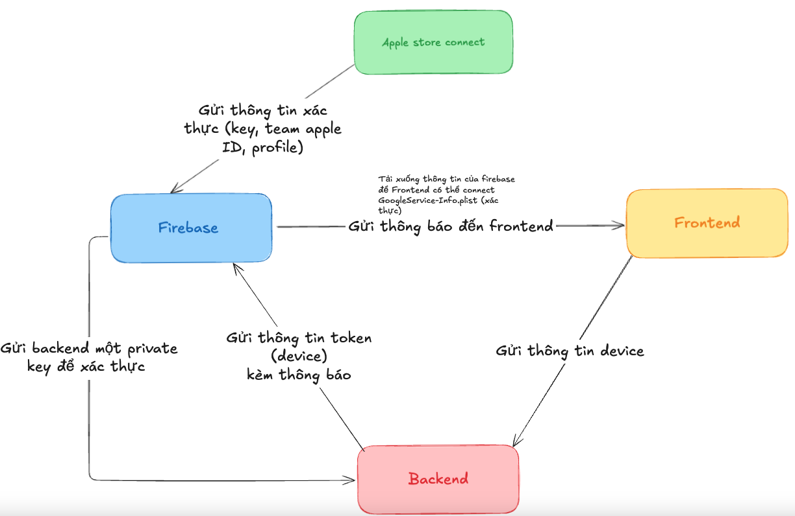
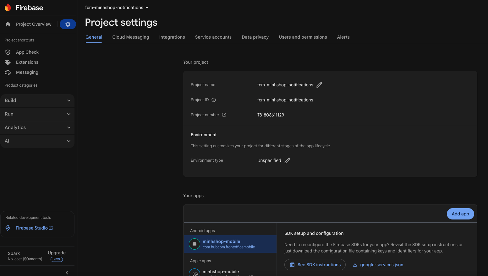
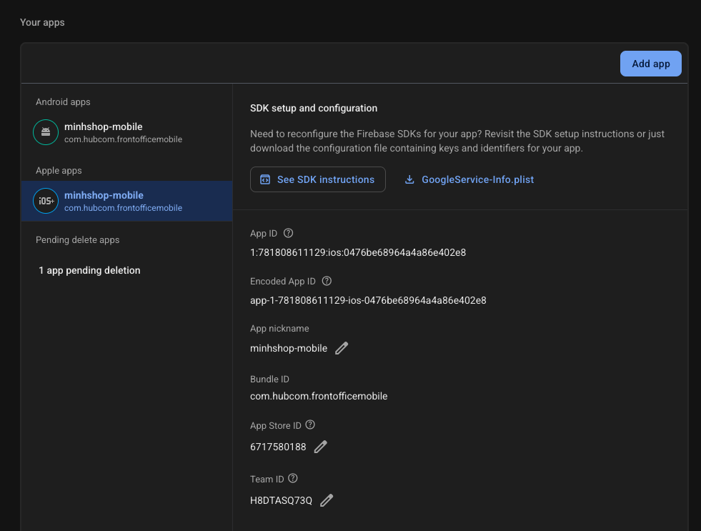

# React Native Firebase

Requirement: Bạn phải config [Firebase](/https://rnfirebase.io/) trong React Native vì Firebase Cloud Messaging (FCM) là nền tảng trung gian giúp ứng dụng đăng ký device token, kết nối với server, và gửi – nhận push notification một cách ổn định trên Android và iOS. Không có FCM, app sẽ không có kênh chung để backend gửi thông báo đến thiết bị.

## Mô hình Connect



### Bước 1: Tạo project ở [firebase console](https://console.firebase.google.com/u/1/)



### Bước 2: Cài package cần thiết

```md
# Install & setup the app module

yarn add @react-native-firebase/app

# Install the messaging module

yarn add @react-native-firebase/messaging
```

### Bước 3: Tạo App trong project đã tạo ở firebase console (IOS/android)



### Bước 4: Tải file GoogleService-Info.plist (IOS), google-services.json (android) và config trong app.json

```md
{
  "expo": {
    "android": {
      "googleServicesFile": "./google-services.json",
      "package": "com.mycorp.myapp"
    },
    "ios": {
      "googleServicesFile": "./GoogleService-Info.plist",
      "bundleIdentifier": "com.mycorp.myapp"
    },
    "plugins": [
      "@react-native-firebase/app",
      "@react-native-firebase/auth",
      "@react-native-firebase/crashlytics",
      [
        "expo-build-properties",
        {
          "ios": {
            "useFrameworks": "static"
          }
        }
      ]
    ]
  }
}
```

### Bước 5: Configure Firebase with iOS credentials (react-native 0.77+)

[Configure Firebase with iOS credentials (react-native 0.77+)](https://rnfirebase.io/#configure-firebase-with-ios-credentials-react-native-077)

### Bước 6: For IOS => config: steps by steps

[iOS Messaging Setup | React Native Firebase](https://rnfirebase.io/messaging/usage/ios-setup)

Note: config error in podfile [Swift pods cannot yet be integrated as static libraries FirebaseCoreInternal-library](https://stackoverflow.com/questions/72289521/swift-pods-cannot-yet-be-integrated-as-static-libraries-firebasecoreinternal-lib)

### Bước 7: Setup in frontend (layout.tsx or App.tsx)

[Cloud Messaging | React Native Firebase](https://rnfirebase.io/messaging/usage#android---requesting-permissions)

### Bước 8: Build in xcode and test

## Thanks you
